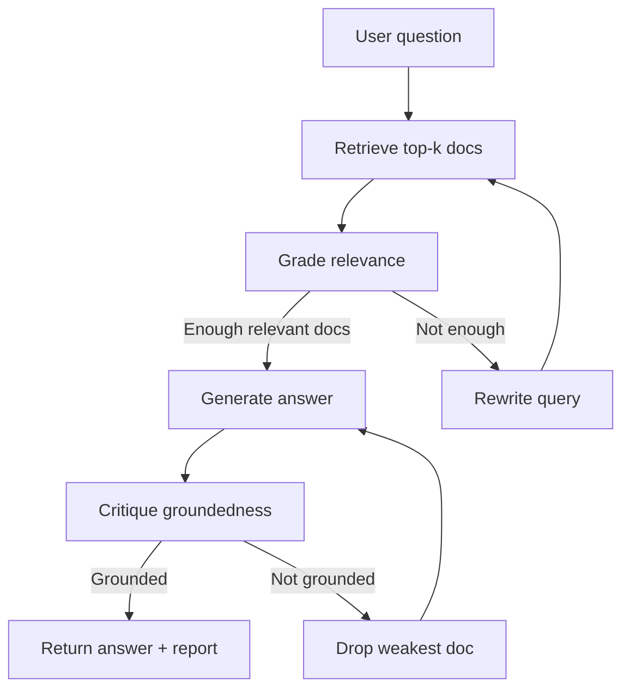

# Corrective Agentic RAG

A small, educational Python project that demonstrates **Corrective Retrieval-Augmented Generation (CRAG)** in an **agentic loop**. Instead of retrieving once and hoping for the best, the agent grades documents, rewrites weak queries, generates answers, and critiques whether the output is actually grounded in the sources.

Run it in **demo mode** with zero API cost, or switch to **live mode** to use Claude for real semantic judgments.

---

## Why this exists

Traditional RAG follows a fixed pipeline: retrieve → generate. If retrieval returns irrelevant context, the model often hallucinates anyway.

This project models a corrective loop:

1. **Retrieve** candidate documents from a local knowledge base.
2. **Grade** each document for relevance to the question.
3. **Rewrite** the query if nothing useful was found, then retrieve again.
4. **Generate** an answer from the relevant documents only.
5. **Critique** whether the answer is grounded in those sources; if not, retry with leaner context.

The loop runs up to 3 iterations per phase, with full step-by-step tracing and a saved markdown report for every run.

---

## Architecture



| Step | Demo backend | Live backend |
|------|--------------|--------------|
| **Retrieve** | TF-IDF + cosine similarity | Same |
| **Grade** | Keyword overlap threshold | Claude relevance judge |
| **Rewrite** | Synonym expansion + filler stripping | Claude query reformulation |
| **Generate** | Template-based synthesis | Claude with citation prompt |
| **Critique** | Vocabulary overlap check | Claude groundedness judge |

---

## Project structure

```
agentic-rag-corrective/
├── agent.py                 # Main entry point and state machine
├── core/
│   ├── retriever.py         # TF-IDF retriever over knowledge_base.json
│   ├── grader.py            # Document relevance grading
│   ├── rewriter.py          # Query rewriting on weak retrieval
│   ├── generator.py         # Answer generation from context
│   └── critic.py            # Groundedness checking
├── data/
│   └── knowledge_base.json  # Sample RAG/ML knowledge base (10 on-topic + decoys)
├── reports/                 # Auto-generated markdown reports (created on first run)
├── requirements.txt
└── .env.example
```

---

## Requirements

- Python 3.10+
- Dependencies: `scikit-learn`, `anthropic`, `python-dotenv`

---

## Installation

```bash
git clone <your-repo-url>
cd agentic-rag-corrective

python -m venv .venv

# Windows
.venv\Scripts\activate

# macOS / Linux
source .venv/bin/activate

pip install -r requirements.txt
```

### Live mode (optional)

Copy the example env file and add your Anthropic API key:

```bash
cp .env.example .env
```

Edit `.env`:

```env
ANTHROPIC_API_KEY=sk-ant-your-key-here
```

Get a key at [console.anthropic.com](https://console.anthropic.com/settings/keys).

---

## Usage

### Demo mode (no API key)

Uses deterministic, rule-based backends. Great for learning the loop without spending tokens.

```bash
python agent.py "What is corrective RAG and how does it reduce hallucination?"
```

### Live mode (Claude)

Uses Claude (`claude-sonnet-4-6`) for grading, rewriting, generation, and critique.

```bash
python agent.py "How does agentic RAG differ from traditional RAG?" --live
```

### Quiet mode

Suppress step-by-step trace output; still prints the final answer and report path.

```bash
python agent.py "What are common RAG evaluation metrics?" --quiet
```

---

## Example output

Running a question prints a live trace:

```
[RETRIEVE] iteration 1 | query = 'What is corrective RAG?'
[GRADE] 'Corrective RAG (CRAG)' -> RELEVANT (2 of 3 query keywords matched; retrieval score 0.41)
[GRADE] 'Self-RAG and Reflection Tokens' -> irrelevant (1 of 3 query keywords matched; retrieval score 0.12)
[GENERATE] draft #1 produced (412 chars)
[CRITIQUE] GROUNDED - 78% of the answer's vocabulary is traceable to the source documents.

======================================================================
**Answer:** Based on 1 relevant source(s):
...
======================================================================

Saved report to: reports/20260711_081500_What_is_corrective_RAG.md
```

Each run saves a markdown report under `reports/` with the answer, sources, groundedness flag, and iteration counts.

---

## Knowledge base

The bundled `data/knowledge_base.json` contains short articles on RAG topics (vector DBs, chunking, CRAG, Self-RAG, groundedness checks, query rewriting, agentic RAG, evaluation metrics, and agent state machines), plus a few off-topic decoy documents to exercise the grader.

To use your own data, replace or extend this file. Each entry needs:

```json
{
  "id": "d001",
  "title": "Document title",
  "content": "Full text content..."
}
```

The retriever indexes `title + content` with TF-IDF. For production use, swap `Retriever` for a vector database without changing the rest of the pipeline.

---

## Configuration

Key constants in `agent.py`:

| Constant | Default | Description |
|----------|---------|-------------|
| `MAX_ITERATIONS` | `3` | Max loops for retrieval and generation phases |
| `MIN_RELEVANT_DOCS` | `1` | Stop rewriting once this many relevant docs are found |

Retriever `k` (top documents per query) is set to `3` in the agent loop. Adjust in `agent.py` if needed.

---

## How each module works

### Retriever (`core/retriever.py`)

TF-IDF vectorizer over the local JSON corpus. Returns top-k documents with cosine similarity scores. Serves as a stand-in for Pinecone, Qdrant, pgvector, etc.

### Grader (`core/grader.py`)

Filters retrieved noise before generation. Demo mode uses keyword overlap; live mode asks Claude a strict yes/no relevance question per document.

### Rewriter (`core/rewriter.py`)

Triggered when grading finds no relevant documents. Demo mode expands acronyms (`rag` → `retrieval augmented generation`) and strips filler words. Live mode asks Claude to reformulate the query given weak result titles.

### Generator (`core/generator.py`)

Synthesizes a final answer from graded-relevant documents only. Live mode instructs Claude to cite document IDs inline and refuse to guess beyond the context.

### Critic (`core/critic.py`)

Post-generation safety check. If the answer is not grounded, the agent drops the weakest remaining document and regenerates with leaner context, up to `MAX_ITERATIONS` times.

---

## Limitations

This is a teaching/demo project, not production infrastructure:

- Retrieval is TF-IDF, not semantic embeddings.
- Demo backends use heuristics, not true language understanding.
- No web search fallback (a common CRAG extension).
- Single-process CLI; no API server or UI.

Natural next steps: swap in a vector store, add LangGraph or similar for visualization, plug in web search for the rewrite branch, and batch-evaluate with RAGAS-style metrics.

---

## License

MIT (or your preferred license — update this section as needed).
